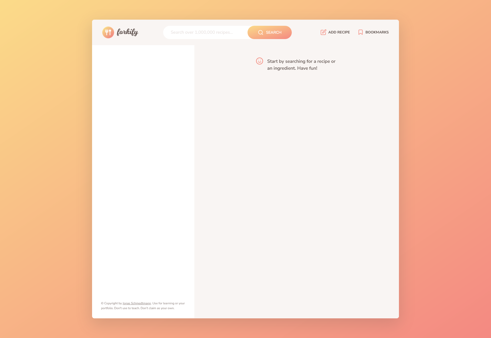
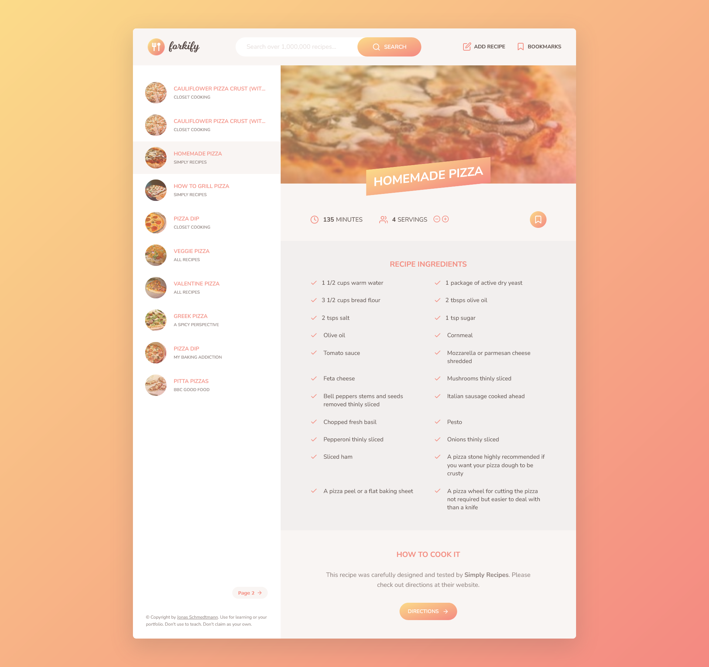

# Forkify Project

This project is build on MVC architecture which helps in keeping the project modular and maintainable. The project was build for learning purpose.

## Table of contents

- [Overview](#overview)
  - [Screenshot](#screenshot)
  - [Links](#links)
- [My process](#my-process)
  - [Built with](#built-with)
  - [What I learned](#what-i-learned)
  - [How To Run](#how-to-run)
- [Author](#author)

## Overview

### Screenshot

### Links

- Repository URL: [Github repository](https://github.com/develover-sk/forkify-app)
- Live Site URL: [See it Live]()
- NOTE: Upload recipe will not work without API_KEY in config-file in live Site URL.

## My process

### Built with

- HTML5
- CSS
- JavaScript
- VSCode

### What I learned

- Using this project, I learned how to implement MVC architecture for better code structure and modularity of project.
- Learned to debug Code, fixed bug which was left unaddressed in original project tutorial.
  - Add Recipe Form was not resetting after upload, which made it reload page if a user wants to upload another recipe in same session.
- Different approaches to solve problems for an web app, like Subscriber-Publisher Design Pattern for handling event from controller and adding even handler in view file.

### How To Run with npm

- Clone repository using ssh or https using above link from repository '<> Code' dropdown menu.
- Open folder in VS Code.
- Change API_KEY in config.js in './src/js/config.js' with your API_KEY generated from 'https://forkify-api.herokuapp.com/v2' HOME PAGE.
- Open terminal
- run command 'npm install' to install all dependencies.
- run command 'npm start' to run the live server.
- Copy the link of localhost with post address from terminal, and paste it in browser.
- You can now try the app in browser.

## Author

- Website - [Shailendra Kumar](https://www.shailendra.xyz)
- X (Formely Twitter) - [@shailendrakrsk\_](https://www.twitter.com/shailendrakrsk_)
